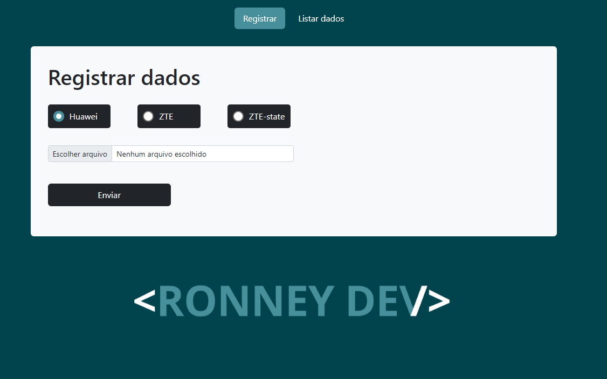
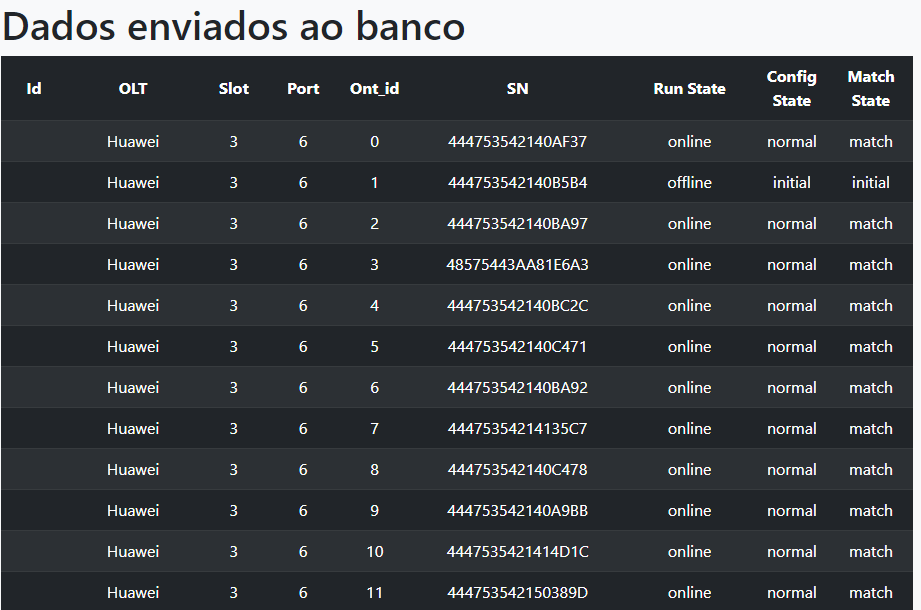
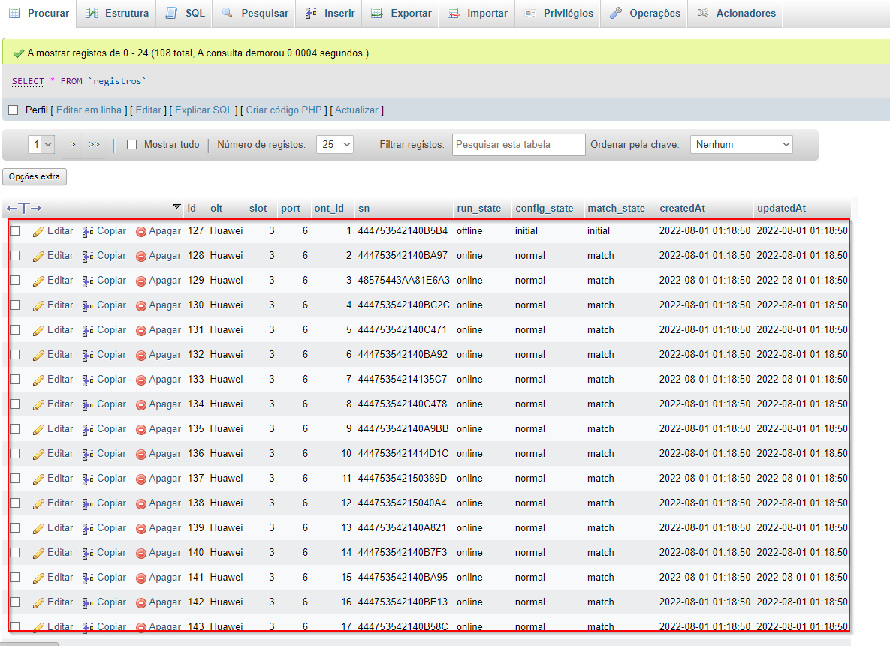

<!-- /////////////////LINGUAGENS////////////////////// -->

## Na construção do projeto foi utilizado as seguintes linguagens / frameworks

### _Front-end_

- Html
- Css
- Javascript
- Bootstrap

### _Back-end_

- NodeJs juntamente com o handlebars para processar o template do front
- MySql

### _Também foi utilizado o Docker_

<!-- /////////////////DEPENDÊNCIAS////////////////////// -->

### Instalar as seguintes dependências

> npm install express \
> npm install -g nodemon \
> npm install --save sequelize \
> npm install --save mysql2 \
> npm install express-handlebars --save \
> nnpm install sequelize --save \
> npm install multer --save

<!-- /////////////////UTILIZAÇÃO////////////////////// -->

##### 1. Com a aplicação rodando agora basta acessar através do navegador utilizando a porta 3000.

##### 2. Na pagina principal é onde faremos o envio do arquivo txt (os arquivos para teste estão dentro da pasta input) com as informações a serem enviadas ao banco, basta apenas selecionar o arquivo em qualquer lugar da sua máquina.

##### 3. Existem 3 opções para marcar de qual equipamento se refere o arquivo, porém não é obrigatório que seja marcado o correto, nem mesmo é obrigatório selecionar algum, eu havia feito dessa forma mas posteriormente eu melhorei o código para que faça essa verificação de forma automática, deixei apenas como demonstração.

##### 4. Após o envio do arquivo, você será redirecionado para uma página mostrando os dados que foram enviados ao banco, referente ao arquivo que foi feito upload, porém essa informação é referente apenas ao arquivo enviado naquele momento.

##### 5. Caso queira ver todos os registros no banco de dados, basta navegar no menu no topo da página com o título "Listar dados", ele irá filtrar todos os registros, inclusive com a possibilidade de exclusão de algum registro por lá mesmo.

##### 6. Obs: caso queiram acessar e verificar o banco diretamente pelo phpMyAdmin basta acessar através da porta 8000 e colocar as informações do banco: servidor: db / utilizador: root / senha: root

